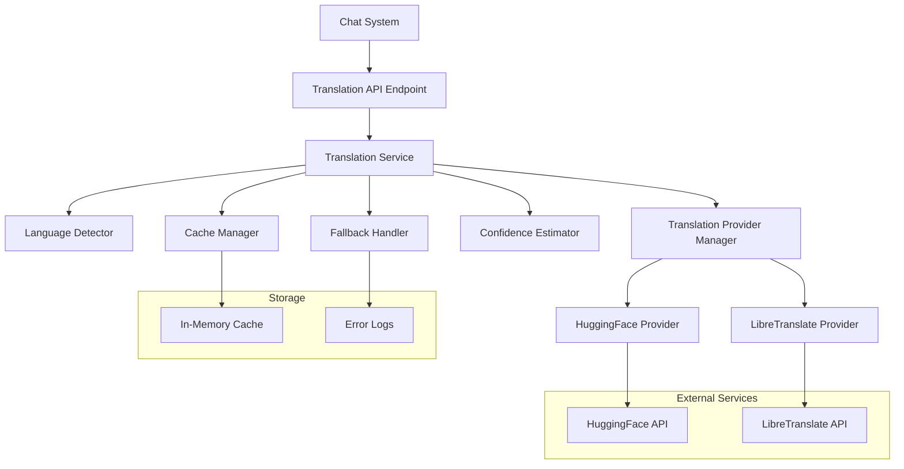

# Design Document: Multilingual Translation AI Module

## Overview

The Multilingual Translation AI Module is a Node.js-based service that provides real-time translation capabilities for the "Multilingual Mandi" chat-based marketplace. The system leverages external AI translation APIs (HuggingFace and LibreTranslate) to translate text between Indian languages while maintaining high performance through intelligent caching and robust error handling.

The architecture follows a modular design pattern with clear separation of concerns, making it easy to integrate with existing chat infrastructure and scale horizontally. The service supports automatic language detection, confidence scoring, and graceful fallback mechanisms to ensure reliable operation even when external services are unavailable.

## Architecture

The system follows a layered architecture with the following components:



### Component Responsibilities

- **Translation API Endpoint**: Express.js REST endpoint handling HTTP requests
- **Translation Service**: Core orchestration layer managing the translation workflow
- **Language Detector**: Automatic source language identification using statistical models
- **Cache Manager**: LRU cache for storing and retrieving previous translations
- **Translation Provider Manager**: Abstraction layer for multiple translation APIs
- **Confidence Estimator**: Calculates reliability scores for translations
- **Fallback Handler**: Manages error scenarios and alternative translation methods

## Components and Interfaces

### Translation Service Interface

```javascript
class TranslationService {
  async translate(text, targetLanguage, sourceLanguage = null) {
    // Returns: { originalText, translatedText, sourceLang, targetLang, confidenceScore }
  }
  
  async detectLanguage(text) {
    // Returns: { language, confidence }
  }
  
  async getHealth() {
    // Returns: { status, providers, cache }
  }
}
```

### Translation Provider Interface

```javascript
class TranslationProvider {
  async translate(text, sourceLang, targetLang) {
    // Returns: { translatedText, confidence }
  }
  
  async isAvailable() {
    // Returns: boolean
  }
  
  getSupportedLanguages() {
    // Returns: Array<string>
  }
}
```

### Cache Manager Interface

```javascript
class CacheManager {
  get(key) {
    // Returns: cached translation or null
  }
  
  set(key, value, ttl = 86400000) {
    // Stores translation with 24-hour TTL
  }
  
  generateKey(text, sourceLang, targetLang) {
    // Returns: string hash key
  }
}
```

### Language Detector Interface

```javascript
class LanguageDetector {
  detect(text) {
    // Returns: { language, confidence }
  }
  
  getSupportedLanguages() {
    // Returns: Array<string>
  }
}
```

## Data Models

### Translation Request Model

```javascript
{
  text: string,           // Required: Text to translate (1-1000 chars)
  targetLang: string,     // Required: Target language code (ISO 639-1)
  sourceLang?: string     // Optional: Source language (auto-detect if null)
}
```

### Translation Response Model

```javascript
{
  originalText: string,      // Original input text
  translatedText: string,    // Translated output text
  sourceLang: string,        // Detected/provided source language
  targetLang: string,        // Target language
  confidenceScore: number,   // Confidence score (0.0 - 1.0)
  cached: boolean,          // Whether result came from cache
  provider: string,         // Which translation provider was used
  timestamp: number         // Unix timestamp of translation
}
```

### Error Response Model

```javascript
{
  error: {
    code: string,           // Error code (INVALID_INPUT, API_ERROR, etc.)
    message: string,        // Human-readable error message
    details?: object        // Additional error context
  },
  originalText?: string,    // Original text (if available)
  fallbackUsed: boolean     // Whether fallback mechanism was triggered
}
```

### Cache Entry Model

```javascript
{
  key: string,              // Hash of text + source + target languages
  value: {
    translatedText: string,
    sourceLang: string,
    targetLang: string,
    confidenceScore: number,
    provider: string,
    timestamp: number
  },
  expiresAt: number         // Unix timestamp for expiration
}
```

### Language Support Configuration

```javascript
{
  supportedLanguages: {
    'hi': { name: 'Hindi', code: 'hi', huggingface: 'hi', libretranslate: 'hi' },
    'en': { name: 'English', code: 'en', huggingface: 'en', libretranslate: 'en' },
    'ta': { name: 'Tamil', code: 'ta', huggingface: 'ta', libretranslate: 'ta' },
    'te': { name: 'Telugu', code: 'te', huggingface: 'te', libretranslate: 'te' },
    'bn': { name: 'Bengali', code: 'bn', huggingface: 'bn', libretranslate: 'bn' },
    'mr': { name: 'Marathi', code: 'mr', huggingface: 'mr', libretranslate: 'mr' }
  },
  codeMixedPatterns: {
    'hinglish': { primary: 'hi', secondary: 'en', threshold: 0.3 }
  }
}
```

## Correctness Properties

*A property is a characteristic or behavior that should hold true across all valid executions of a system-essentially, a formal statement about what the system should do. Properties serve as the bridge between human-readable specifications and machine-verifiable correctness guarantees.*

### Property 1: Language Detection Accuracy
*For any* text input in supported languages (Hindi, English, Tamil, Telugu, Bengali, Marathi), the Language_Detector should correctly identify the source language with appropriate confidence scoring
**Validates: Requirements 1.1, 1.4**

### Property 2: Code-Mixed Text Handling
*For any* code-mixed text (Hinglish), the Language_Detector should identify the dominant language component and handle translation appropriately
**Validates: Requirements 1.2, 9.1, 9.2, 9.4**

### Property 3: Language Detection Fallback
*For any* text where language detection confidence is below 70% or detection fails, the system should default to English with proper error handling
**Validates: Requirements 1.3, 1.5**

### Property 4: Translation Request Processing
*For any* valid text and target language combination, the Translation_Service should return a complete translation response with all required fields
**Validates: Requirements 2.1, 6.2, 6.3**

### Property 5: Input Validation
*For any* invalid input (empty text, whitespace-only, malformed requests, missing fields), the Translation_Service should reject the request with appropriate error messages
**Validates: Requirements 2.5, 6.4, 7.5**

### Property 6: Provider Integration and Fallback
*For any* translation request, the system should use HuggingFace as primary provider and automatically fallback to LibreTranslate when primary fails, with final fallback to original text
**Validates: Requirements 3.1, 3.2, 3.3, 7.1, 7.2**

### Property 7: API Error Handling
*For any* external API error (rate limits, timeouts, failures), the system should handle gracefully with appropriate delays, retries, and error responses
**Validates: Requirements 3.4, 3.5, 7.4**

### Property 8: Confidence Score Calculation
*For any* completed translation, the Confidence_Estimator should calculate a score between 0 and 1, flag low confidence translations, and include the score in all responses
**Validates: Requirements 4.1, 4.2, 4.3, 4.4, 4.5**

### Property 9: Cache Hit Behavior
*For any* identical text and target language combination requested multiple times, the Cache_Manager should return cached results on subsequent requests
**Validates: Requirements 5.1**

### Property 10: Cache Management
*For any* cache operations, the system should store complete translation data, expire entries after 24 hours, implement LRU eviction at 10,000 entries, and gracefully handle cache failures
**Validates: Requirements 5.2, 5.3, 5.4, 5.5**

### Property 11: HTTP Error Handling
*For any* internal errors during request processing, the Translation_Service should return appropriate HTTP status codes (400 for client errors, 500 for server errors) with descriptive error messages
**Validates: Requirements 6.4, 6.5**

### Property 12: Error Logging and Monitoring
*For any* error condition, the system should log errors with appropriate severity levels and maintain operational visibility
**Validates: Requirements 7.3**

### Property 13: Concurrent Request Processing
*For any* multiple simultaneous translation requests, the system should process them concurrently without blocking
**Validates: Requirements 8.3**

### Property 14: Large Text Handling
*For any* text exceeding 1000 characters, the Translation_Service should chunk the text appropriately for processing
**Validates: Requirements 8.4**

### Property 15: Formatting Preservation
*For any* text with formatting or structure, the translation should preserve the original formatting where possible
**Validates: Requirements 2.4**

### Property 16: Middleware Integration
*For any* Express.js application, the Translation_Service should provide middleware functions that integrate seamlessly without affecting existing functionality
**Validates: Requirements 10.2**

### Property 17: Stateless Operation
*For any* translation request, the service should operate statelessly to support horizontal scaling and multiple instance deployment
**Validates: Requirements 10.4**

## Error Handling

### Error Categories

1. **Input Validation Errors**
   - Empty or whitespace-only text
   - Invalid language codes
   - Malformed JSON requests
   - Text exceeding maximum length limits

2. **External API Errors**
   - HuggingFace API unavailable or rate limited
   - LibreTranslate API timeout or failure
   - Network connectivity issues
   - Authentication failures

3. **Internal System Errors**
   - Cache storage failures
   - Language detection failures
   - Memory or resource exhaustion
   - Configuration errors

### Error Handling Strategy

```javascript
// Error Response Format
{
  error: {
    code: 'ERROR_CODE',
    message: 'Human readable message',
    details: { /* Additional context */ }
  },
  originalText: 'Original input text',
  fallbackUsed: true/false,
  timestamp: 1234567890
}
```

### Fallback Mechanisms

1. **Translation Provider Fallback**
   - Primary: HuggingFace Transformers
   - Secondary: LibreTranslate API
   - Final: Return original text with error flag

2. **Language Detection Fallback**
   - Primary: Statistical language detection
   - Fallback: Default to English for low confidence

3. **Cache Failure Handling**
   - Continue operation without caching
   - Log cache errors for monitoring
   - Graceful degradation of performance

### Timeout Configuration

- API requests: 10 seconds maximum
- Language detection: 2 seconds maximum
- Cache operations: 500 milliseconds maximum
- Total request timeout: 15 seconds maximum

## Testing Strategy

### Dual Testing Approach

The testing strategy employs both unit tests and property-based tests to ensure comprehensive coverage:

**Unit Tests** focus on:
- Specific examples and edge cases
- Integration points between components
- Error conditions and boundary cases
- Mock external API responses

**Property-Based Tests** focus on:
- Universal properties across all inputs
- Comprehensive input coverage through randomization
- Correctness properties from the design document
- Minimum 100 iterations per property test

### Property-Based Testing Configuration

The system will use **fast-check** library for JavaScript property-based testing with the following configuration:

- **Minimum iterations**: 100 per property test
- **Test tagging**: Each property test references its design document property
- **Tag format**: `Feature: multilingual-translation-ai, Property {number}: {property_text}`

### Test Categories

1. **Language Detection Tests**
   - Property tests for accuracy across supported languages
   - Unit tests for specific language samples
   - Edge cases for code-mixed text

2. **Translation Tests**
   - Property tests for translation completeness
   - Unit tests for specific translation pairs
   - Error handling scenarios

3. **Cache Tests**
   - Property tests for cache hit/miss behavior
   - Unit tests for LRU eviction
   - Cache failure scenarios

4. **API Integration Tests**
   - Property tests for provider fallback
   - Unit tests for specific API responses
   - Network failure simulations

5. **Performance Tests**
   - Concurrent request handling
   - Large text processing
   - Cache performance validation

### Example Property Test Structure

```javascript
// Feature: multilingual-translation-ai, Property 1: Language Detection Accuracy
test('Language detection accuracy for supported languages', () => {
  fc.assert(fc.property(
    fc.record({
      text: fc.string({ minLength: 10, maxLength: 500 }),
      language: fc.constantFrom('hi', 'en', 'ta', 'te', 'bn', 'mr')
    }),
    async ({ text, language }) => {
      const result = await languageDetector.detect(text);
      expect(result.language).toBeDefined();
      expect(result.confidence).toBeGreaterThan(0);
      expect(result.confidence).toBeLessThanOrEqual(1);
    }
  ), { numRuns: 100 });
});
```

### Integration Testing

- **API Endpoint Tests**: Verify REST API functionality
- **Middleware Tests**: Ensure Express.js integration works correctly
- **End-to-End Tests**: Complete translation workflow validation
- **Load Tests**: Concurrent request handling and performance validation

The testing strategy ensures that both specific scenarios (unit tests) and general correctness properties (property tests) are validated, providing comprehensive coverage for the translation service.